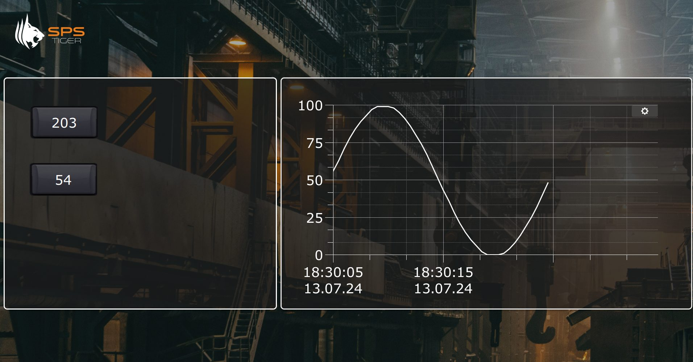
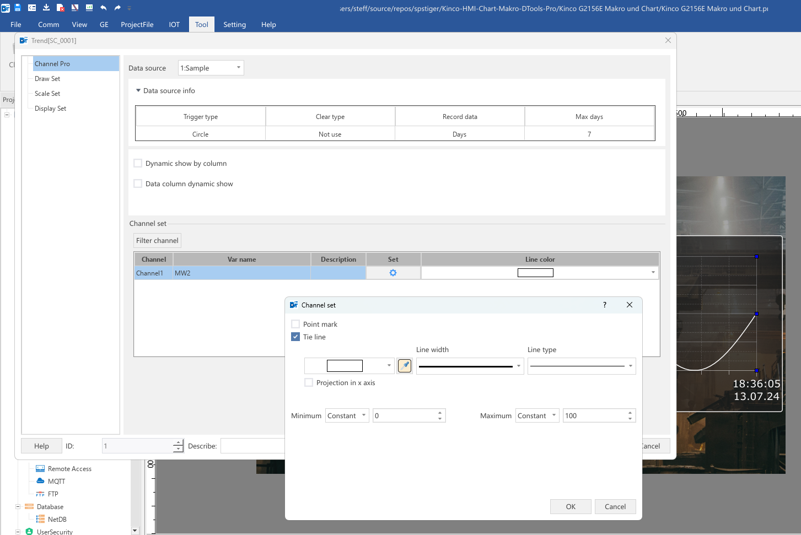
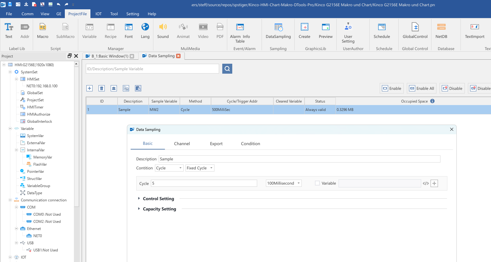
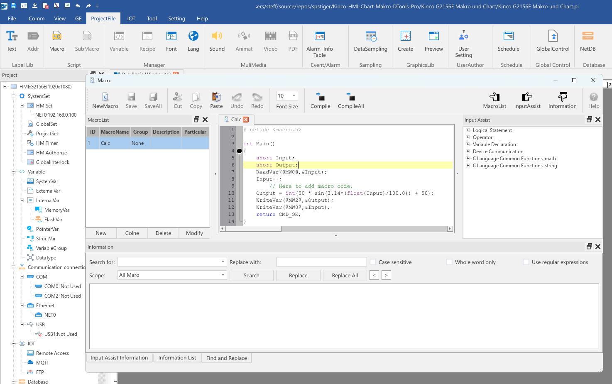
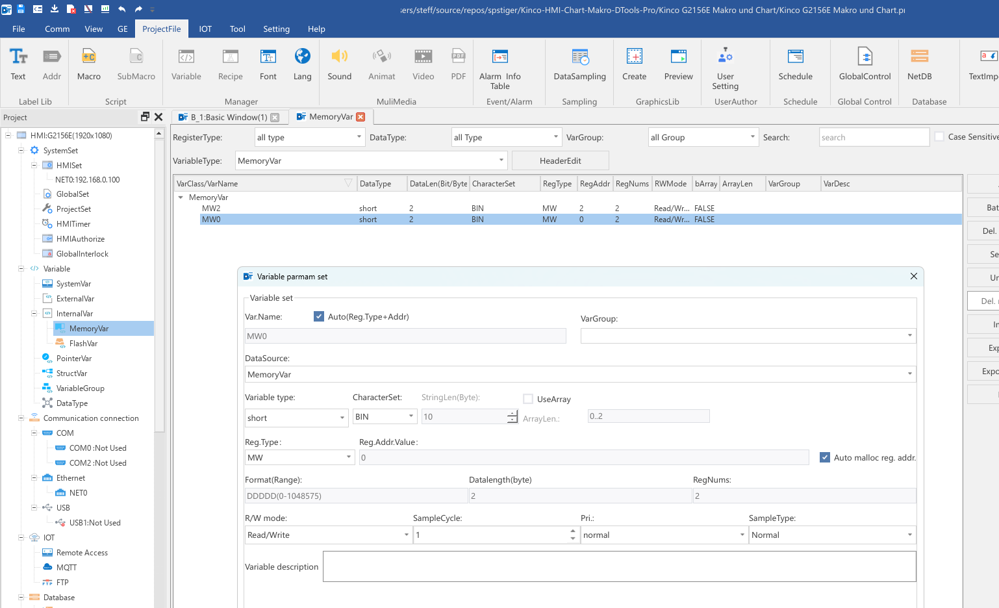
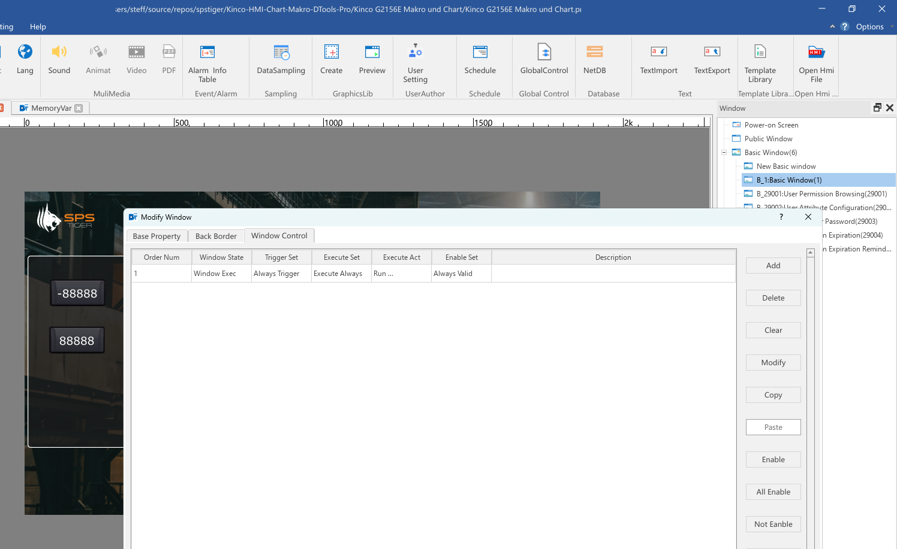
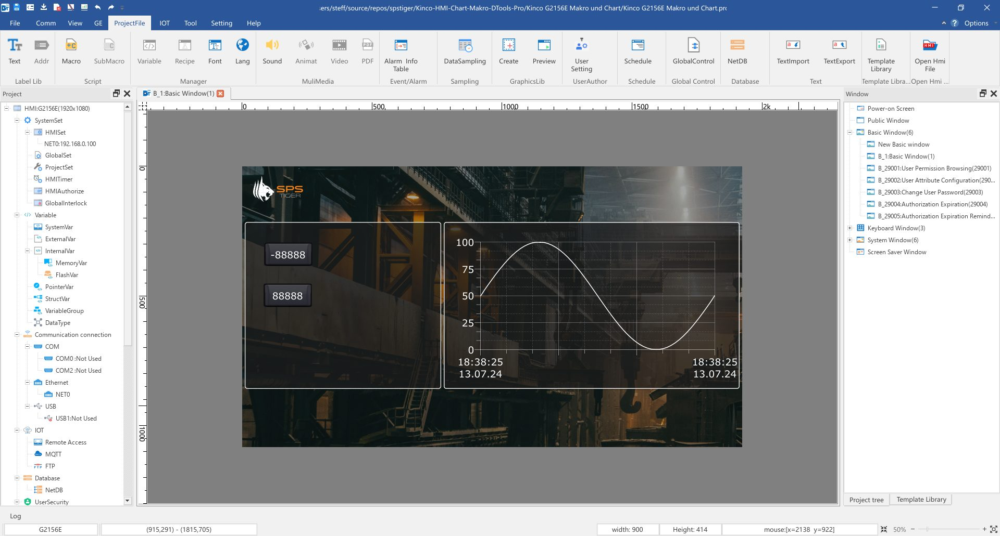

.zip)

# Kinco HMI Beispiel Chart & Makro in DTools Pro

In diesem Beispielprojekt für die neue Kinco DTools Pro zeigen wir euch die neue **Chartfunktion** in Zusammenspiel mit einem **Makro** für die Wertegenerierung.

*Demo für G2156E in Full-HD 1920 x 1080*

*Demo für G2100E in 1024 x 600*

## Benötige Software

Entwicklungsumgebung für Kinco HMI [Kinco DTools Pro](https://www.spstiger.de/moorl-dc-v2/018e8404ae2a7ac4814e52a4b1c03be8/read?path=Kinco%20DTools%20Pro/Kinco%20DToolsPro%20V1.6.0(Build240311).zip) Vers. 1.8 oder höher

## Wozu dieses Beispiel

In diesem Beispiel könnt ihr sehen, wie ihr Datalogger und Trendchart in DTools Pro konfiguriert und über ein Makro Daten generiert. In der Makro-Syntax seht ihr auch, wie ihr aus einem Makro auf eure Projektvariablen zugreifen könnt.

## Funktionen und Komponenten

Dieses Beispielprogramm für die Kinco G2 HMI zeigt, wie ihr eine Trendfunktion umsetzen könnt und mit Makros arbeitet. Es beinhaltet folgende Funktionen:

* **Zahlenanzeige** für einen Zähler und einen berechneten Sinuswert
* **Trendanzeige** für die im Makro berechnete Sinuskurve
* **Makro** zur Berechnung der Sinuskurve aufgerufen über die Fenster-Steuerung (Window Control) in den Window Properties
* **Data Sampling** zum Aufzeichnen der Sinuswerte für den Trend
* Individuelles **Hintergrundbild** (Die Transparenzeffekte wurden in einem externen Grafikprogramm erstellt)
* Zwei **interne Variablen** im MW-Bereich des HMI

*Konfiguration des Trendelements in Kinco DTools Pro*

*Konfiguration des Data Sampling in Kinco DTools Pro*

*Konfiguration eines Makros in DTools Pro und die Anbindung an die Projektvariablen darin über die @var@-Syntax* 

 

*Konfiguration der internen Variablen in Kinco DTools Pro*

*Aufruf des Makro über die Window Control, erreichbar über die Window Properties*

## Für welche HMI funktioniert dieses Beispielprojekt?

Das Projekt wurde für das **Kinco HMI G2156E** mit einer Full-HD Auflösung von 1.920 x 1024 Pixeln erstellt. Es gibt eine zweite Variante des Projekts für das kleinere **Kinco G2100E** mit einer Auflösunge von 1024 * 600. Auch die Modelle F2100E, F2070E2 und G2070HE  haben die gleiche Auflösung. Deshalb kann das Projekt für diese Modelle einfach im Menü HMI Set über HMI Replace auf das HMI in DTools Pro konvertiert werden. 

Für HMI mit anderer Auflösung ist eine Konvertierung über diesen Weg ebenfalls möglich, es werden aber wahrscheinlich Nacharbeiten notwendig, um die Darstellung an das HMI anzupassen.

## Wie starte ich dieses Beispiel?

1. Ladet die aktuelle Version von **Kinco DTools Pro** herunter 
   
   *siehe Link oben*

2. Ladet die Zip-Datei herunter oder **klont** dieses Projekt zum Beispiel über Github Desktop

3. **Öffnet** dieses Projekt in **Kinco DTools Pro** 
   
   *Falls ihr eine neuere Version als 1.6 habt, fragt die Software, ob es in die neueste Version konvertiert werden soll, bestätigt mit ja.*

4. Ruft im Menü **Tool** die **Offline**-Simulation auf oder übertragt das Projekt im selben Menü per **Download auf das HMI**

